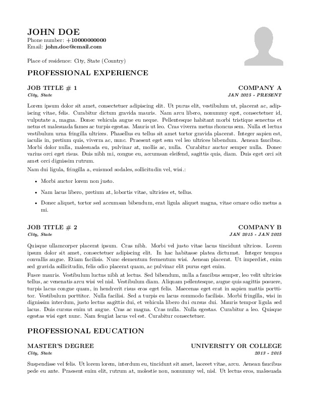

# $\mathrm{\LaTeX}$ resume template

This is a very simple and free template created in $\mathrm{\LaTeX}$ (it comes with a MIT License). So far, this template can only be created on Linux, but is easy to port to other operating systems.

## Preview


## Required packages
To create the pdf (on Arch Linux) you will need these packages:

1. texlive-basic
2. texlive-bibtexextra
3. texlive-bin
4. texlive-binextra
5. texlive-context
6. texlive-fontsextra
7. texlive-fontsrecommended
8. texlive-fontutils
9. texlive-formatsextra
10. texlive-games
11. texlive-humanities
12. texlive-langfrench
13. texlive-latex
14. texlive-latexextra
15. texlive-latexrecommended
16. texlive-luatex
17. texlive-mathscience
18. texlive-meta
19. texlive-metapost
20. texlive-music
21. texlive-pictures
22. texlive-plaingeneric
23. texlive-pstricks
24. texlive-publishers
25. texlive-xetex
26. make

For other distros or operating systems, you can create a PR to add the missing information, otherwise it will take me some time to port it at least to Windows.

## PDF Generation
To create the pdf, I made it really simple. In your terminal you only need to type:
```console
$ make
```
And that's it! Just make sure you are in the same folder as your git repo.

### Makefile
In summary, a Makefile is a file that contains the instructions to create another file. As I mentioned before, `make` is the command to create the pdf. It will only generate a new pdf when either the profile picture, or the tex file gets updated.

> [!NOTE]  
> If you want to rename one or both files, do it also in the Makefile (line 2 and 4).

Other commands available are:

* `make clean` will remove all the 'extra' files (created alongside the pdf) and pdf itself.
* `make rebuild` will do the same thing as `make clean` and additionaly it will rebuild the pdf. You will use this command when `make` fails to recognize your changes (which doesn't happen that often).

## Final thoughts
If you have any problems or suggestions, please submit an issue.
